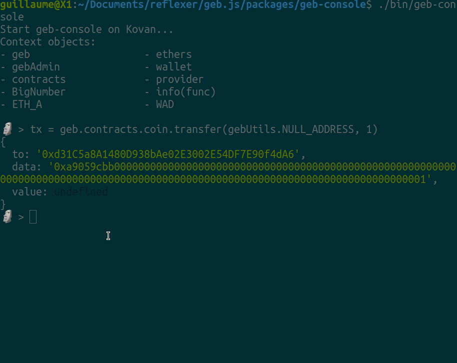

# geb-console

## Install 

```
npm install -g @reflexer-finance/geb-console@latest
```

## Use

To start the console run the command:
```bash
geb-console

# Default network is kovan, to start it on mainnet run
geb-console mainnet

# To preload a private key, pass an env variable PK
PK=0xabc123... geb-console
```

Once loaded you should see:
```
Start geb-console on Kovan...
Context objects:
- geb                   - ethers
- gebAdmin              - wallet
- contracts             - provider
- BigNumber             - info(func)
- ETH_A                 - WAD

🗿 >
```

A few examples of what you can do in the JS console:
```js
// Fetch some system variables
// Hint: use TAB autocomplete to see what's available
🗿 > globalDebt = await geb.contracts.safeEngine.globalDebt()

// Print the BigNumber as string (45 decimals RAD)
🗿 > globalDebt.toString()
'600058105670389218985501651609537665157840485958'

// We expose the objects `ethers`, `provider` and `wallet` from the ether.js library
// Note that `wallet` is only defined if was started with a private key in the env variable PK=0xabc123.. 
🗿 > amount = ethers.utils.parseEther('1')

🗿 > await wallet.getBalance()
BigNumber { _hex: '0x152966db5e2e62e08ba0', _isBigNumber: true }

// Hint: use the underscore to refer to the previous command result
🗿 > _.toString()
'33424268449729776544'

🗿 > wallet.address
'0x7eb8caf136Ba45DD16483188cbe8b615f6251ca7'

// Hint: use the `info` function to see the prototype of a function
🗿 > info(geb.contracts.liquidationEngine.liquidateSAFE)
'function (collateralType, safe)'

// Contract interaction e.g: Manually liquidate a safe
🗿 > geb.contracts.liquidationEngine.liquidateSAFE(ETH_A, '0xc6a789e33b40b13144e21816b853744562686131')
{
  to: '0x84334811e26fc70cC5a68BB2878b0F18E278C397',
  data: '0x4c28be574554482d41000000000000000000000000000000000000000000000000000000000000000000000000000000c6a789e33b40b13144e21816b853744562686131',
  value: undefined
}

// The previous command created a transaction request object, now use the wallet to send the transaction
🗿 > (await wallet.sendTransaction(_)).hash
'0xdef943abb1a9a65c44a5c3d8ac23e3b7448911f0c020375f936b38a84c2e6209' // We can check this hash on etherscan

// Hint: use the `.editor` command to paste a multiline command
// Hint: access all contract of the GEB system under `geb.contracts.` or `gebAdmin.contractsAdmin.`
// Hint: See geb.js docs https://docs.reflexer.finance/geb-js/geb-js-get-started
```

Sign transactions with metamask!
```js
// Send one RAI to 0x7eb123...
🗿 > tx = geb.contracts.coin.transfer("0x7eb123...", WAD)
🗿 > metamask(tx)
Open you browser at http://localhost:8084
```

